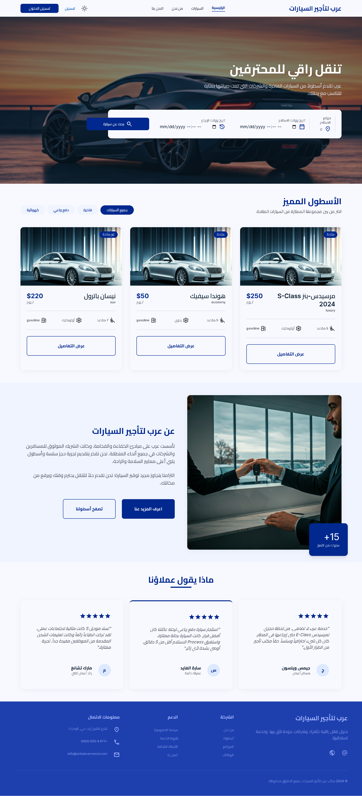
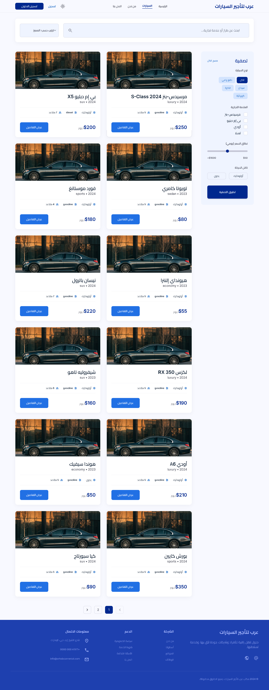
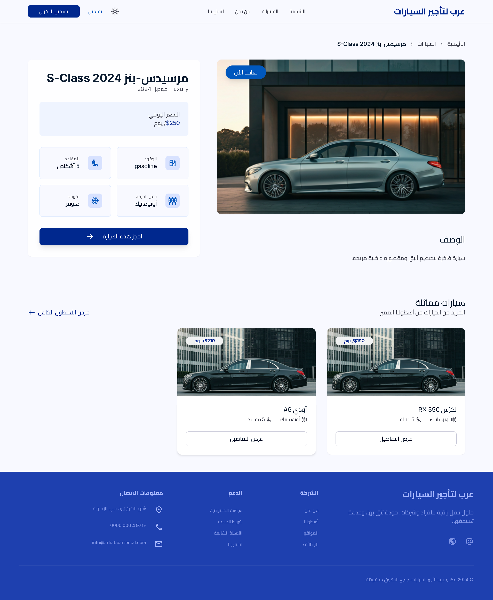
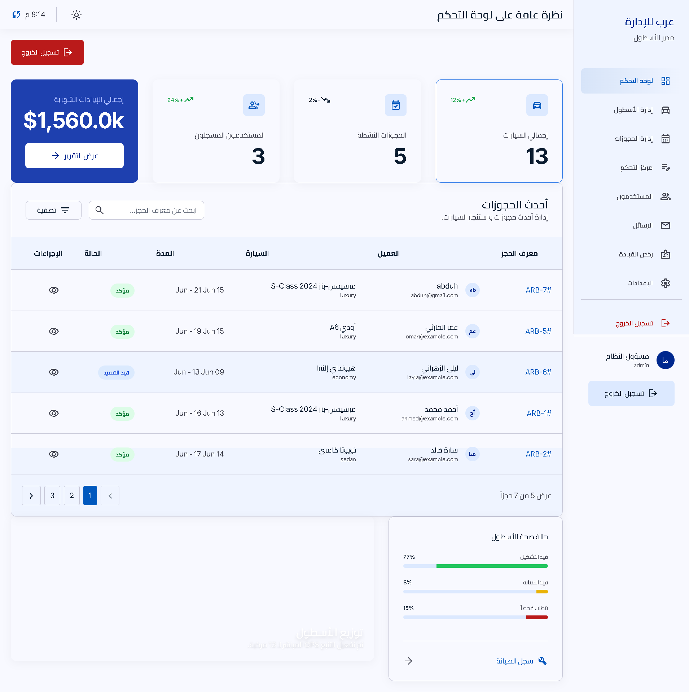

# عرب لتأجير السيارات - Arhab Car Rental Platform

A full-featured bilingual (Arabic/English) car rental management system built with **Laravel 11**, **Livewire 3**, and **Vue 3**.

## Screenshots

| Page | Screenshot |
|------|-----------|
| **Homepage** |  |
| **Cars Listing** |  |
| **Car Details** |  |
| **Admin Dashboard** |  |

Images live in [`public/images/screenshots/`](public/images/screenshots/) in the repository.

## Features

- **Dual Frontend** — Vue 3 SPA for public pages + Livewire 3 for admin panels
- **Multi-Image Gallery** — Upload and display multiple images per car (with primary image badge)
- **Interactive Fleet Map** — Leaflet map with 10 Yemeni city markers on admin dashboard and control center
- **Dark Mode** — Full theme toggle with CSS custom properties, persistent via localStorage
- **SPA Auth** — API token + session-based auth detection; auto-clears stale tokens
- **Offline-Ready Fonts** — Cairo (Arabic), Inter (Latin), Material Symbols served locally via npm (no CDN)
- **OCR Integration** — AI-based driver license text extraction
- **Full-Text Search** — Meilisearch via Laravel Scout; fuzzy, typo-tolerant search on all admin tables
- **REST API** — Sanctum-protected endpoints for cars, bookings, contact, auth
- **Responsive RTL** — Fully right-to-left layout with Arabic-first UX

## Requirements

| Dependency | Version |
|------------|---------|
| PHP | 8.1+ |
| Composer | 2.x |
| Node.js | 18+ |
| NPM | 9+ |
| Database | MySQL 8.0+ / MariaDB 10.6+ |
| Extensions | `gd`, `pdo_mysql`, `mbstring`, `xml`, `curl`, `fileinfo` |

## Installation

### 1. Clone the repository

```bash
git clone https://github.com/albabuskits/car-rental-website.git
cd car-rental-website
```

### 2. Install PHP dependencies

```bash
composer install
```

### 3. Install JavaScript dependencies

```bash
npm install
```

### 4. Configure environment

```bash
cp .env.example .env
php artisan key:generate
```

Open `.env` and set your database connection:

```
DB_CONNECTION=mysql
DB_HOST=127.0.0.1
DB_PORT=3306
DB_DATABASE=arhab_rental
DB_USERNAME=root
DB_PASSWORD=
```

Also set your app URL:

```
APP_URL=http://localhost:8000
```

### 5. Run database migrations

```bash
php artisan migrate
```

### 6. Seed sample data (optional but recommended)

```bash
php artisan db:seed --class=SampleDataSeeder
```

This creates:
- Admin user: `admin@arhab.rentals` / `password`
- Register a new account at `/register` for a test user
- Sample cars, bookings, and permissions

### 7. Create storage symlink

```bash
php artisan storage:link
```

### 8. Setup Meilisearch (search engine)

Search uses Laravel Scout with the `database` driver by default (no external service needed). For faster, typo-tolerant full-text search, optionally enable Meilisearch:

**Setup Meilisearch (optional):**
1. Download and run Meilisearch from [meilisearch.com](https://www.meilisearch.com/download)
2. Edit `.env`:

```
SCOUT_DRIVER=meilisearch
MEILISEARCH_HOST=http://localhost:7700
MEILISEARCH_KEY=masterKey
```

3. Import data:
```bash
php artisan scout:import "App\Models\Car"
php artisan scout:import "App\Models\Booking"
php artisan scout:import "App\Models\User"
php artisan scout:import "App\Models\ContactMessage"
php artisan scout:import "App\Models\DriverLicense"
```

### 9. Build frontend assets

```bash
npm run build
```

## Running the Project

Start the Laravel development server:

```bash
php artisan serve
```

Visit **http://localhost:8000** in your browser.

For development with Vite hot-reloading (runs alongside `php artisan serve`):

```bash
npm run dev
```

## Default Accounts (after seeding)

| Role | Email | Password |
|------|-------|----------|
| **Admin** | `admin@arhab.rentals` | `password` |
| **User** | *(register at `/register`)* | `password` |

## Key Commands

| Command | Description |
|---------|-------------|
| `npm run build` | Build production assets |
| `npm run dev` | Start Vite dev server with HMR |
| `php artisan serve` | Start Laravel dev server |
| `php artisan migrate` | Run database migrations |
| `php artisan migrate:fresh --seed` | Reset DB and seed data |
| `php artisan storage:link` | Create public/storage symlink |
| `php artisan view:clear` | Clear cached Blade views |
| `php artisan optimize:clear` | Clear all cached files |
| `php artisan db:seed --class=SampleDataSeeder` | Seed sample data |
| `php artisan db:seed --class=SearchTestDataSeeder` | Seed extra data for search testing |
| `php artisan scout:import "App\Models\Car"` | Index cars in Meilisearch |
| `php artisan scout:import "App\Models\Booking"` | Index bookings in Meilisearch |
| `php artisan scout:import "App\Models\User"` | Index users in Meilisearch |
| `php artisan scout:import "App\Models\ContactMessage"` | Index messages in Meilisearch |
| `php artisan scout:import "App\Models\DriverLicense"` | Index licenses in Meilisearch |
| `php artisan scout:flush "App\Models\Car"` | Clear cars index |
| `composer run-script pint` | Format PHP code (Laravel Pint) |

## Project Structure

```
app/
├── Http/
│   └── Controllers/
│       └── Api/
│           ├── AuthController.php      # Login/logout/me (token + session)
│           ├── BookingController.php   # CRUD bookings API
│           ├── CarController.php       # Cars listing/details/featured/similar
│           └── ContactController.php   # Contact form submission
├── Livewire/
│   ├── AdminCars.php         # Fleet CRUD with multi-image upload
│   ├── AdminBookings.php     # Booking management
│   ├── AdminControlCenter.php # Dashboard stats & activity
│   ├── AdminDashboard.php    # Admin home stats
│   ├── AdminLicenses.php     # License OCR management
│   ├── AdminUsers.php        # User management
│   ├── UserDashboard.php     # User dashboard
│   └── UserDriverLicense.php # User license upload
├── Models/
│   ├── Car.php               # Car model (images relationship)
│   ├── CarImage.php          # Multi-image model
│   ├── Booking.php           # Booking model
│   ├── DriverLicense.php     # License model
│   └── ContactMessage.php    # Contact form model
└── Services/
    ├── AiOcrService.php      # AI OCR for licenses
    └── OcrService.php        # OCR interface

resources/
├── js/
│   ├── components/
│   │   ├── AppHeader.vue     # Nav with active-link underline indicator
│   │   └── AppFooter.vue     # Footer adapted for dark mode
│   ├── views/
│   │   ├── HomePage.vue      # Landing page (dynamic featured cars)
│   │   ├── CarsListing.vue   # Car catalog (dynamic from API)
│   │   ├── CarDetails.vue    # Car detail with image gallery
│   │   ├── BookingPage.vue   # 3-step booking form
│   │   ├── AboutUs.vue       # About page
│   │   ├── ContactUs.vue     # Contact page
│   │   └── LoginPage.vue     # SPA login
│   ├── router/index.js       # Vue Router config
│   └── main.js               # Vue app entry point
├── views/
│   ├── layouts/
│   │   ├── admin.blade.php   # Admin dashboard layout
│   │   └── user.blade.php    # User dashboard layout
│   └── livewire/
│       ├── admin-cars.blade.php    # Car form with multi-image upload
│       ├── admin-control-center.blade.php  # Leaflet map
│       └── ...
└── css/
    └── app.css               # Tailwind + all dark mode overrides

routes/
├── api.php                   # REST API routes (cars, bookings, auth)
├── web.php                   # Web routes (admin, dashboard, SPA)
└── auth.php                  # Authentication routes
```

## Architecture Notes

### Multi-Image Upload Flow
1. Admin uploads images via the "إضافة سيارة جديدة" modal
2. Images are stored to `storage/app/public/cars/`
3. Records created in `car_images` table with `car_id`, `image_path`, `is_primary`
4. First image gets `is_primary = true`
5. Frontend serves images via `/storage/cars/...` symlink
6. Delete car removes all associated images from disk and DB

### SPA Auth Flow
1. User logs in via Livewire (`/login`) or Vue (`/login`)
2. Token stored in `localStorage` + `axios` default header
3. On app mount, `/api/user` validates token
4. If token invalid, it's cleared silently
5. Session-based Livewire auth also detected (no token needed)
6. Logout calls `/api/logout` which handles both token and session

### Dark Mode
- Toggle saved to `localStorage` as `light`, `dark`, or `auto`
- CSS custom properties (`--color-*`) in `app.css` handle all color tokens
- `.dark` class on `<html>` triggers Tailwind `dark:` variants
- Global element selectors (`input`, `textarea`, `select`) use CSS vars for dark backgrounds
- Each page's hardcoded `bg-*`/`text-*` classes have corresponding `dark:` overrides

### Offline Fonts
- Cairo: `@fontsource/cairo` (Arabic weights 200-900)
- Inter: `@fontsource/inter` (Latin weights 100-900)
- Material Symbols: `material-symbols` npm package
- No external CDN calls — all fonts bundled in `npm run build`

## Troubleshooting

| Issue | Solution |
|-------|----------|
| Blank page after build | Run `php artisan view:clear` |
| Images not showing | Run `php artisan storage:link`, verify symlink exists |
| Vite hot-reload not working | Ensure `APP_URL` in `.env` matches `php artisan serve` URL |
| 419 expired page | Run `php artisan optimize:clear` |
| Migration errors | Ensure `.env` database credentials are correct, DB exists |
| Car images not displaying in gallery | Check `/storage/cars/` directory has the uploaded files |

## API Endpoints

| Method | Endpoint | Description |
|--------|----------|-------------|
| GET | `/api/cars` | List available cars (paginated, filterable) |
| GET | `/api/cars/featured` | Random featured cars (3) |
| GET | `/api/cars/{id}` | Single car with images |
| GET | `/api/cars/{id}/similar` | Similar cars by category |
| POST | `/api/bookings` | Create a booking |
| POST | `/api/contact` | Submit contact form |
| POST | `/api/login` | Login (returns token) |
| POST | `/api/logout` | Logout (clears token + session) |
| GET | `/api/user` | Get authenticated user |

## License

Proprietary — All rights reserved.  
© 2024 مكتب عرب لتأجير السيارات
